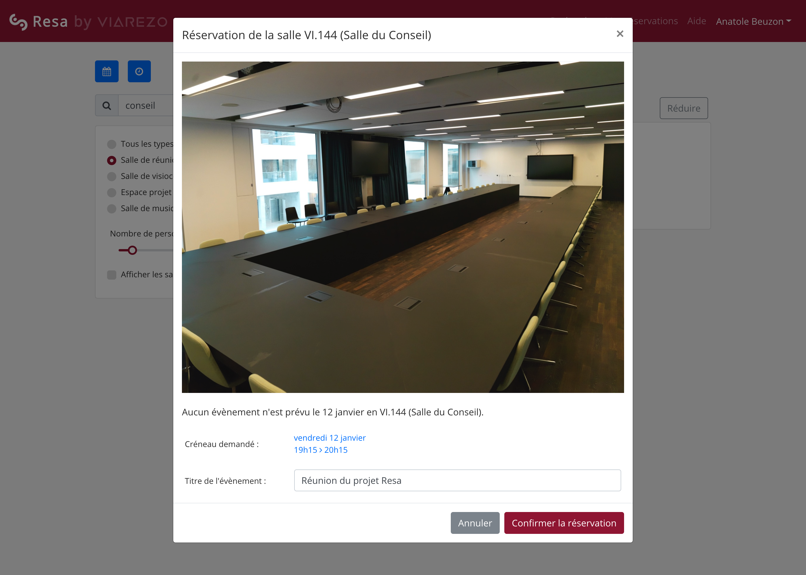

# Resa, an open-source room-booking website

Resa is a room-booking website designed with UX in mind.

It is used in production at French engineering school CentraleSupélec and enables thousands of students, teachers, researchers and staff members to check room availability and book rooms online. Our hope is that it provides an intuitive and natural booking experience.

[Watch the 1-minute demo >>](https://vimeo.com/250163250)

## General structure

It consists of two parts:

- a front-end, namely a single-page JavaScript application written in React
- a back-end, written in Node.js

The back-end is stateless: it communicates with GEODE, a (proprietary) campus management system designed by [Alcuin](http://www.alcuin.com/). If your organization does not use GEODE, Resa will not work out of the box, but you may use the front-end and rewrite the back-end to fit your needs.

## Features

Key features:

- book a room in less than a minute
- receive by email a booking confirmation with an ICS event for your calendar
- easily modify or cancel your booking online
- mobile-friendly interface

Advanced features:

- filter rooms by type or capacity
- use fuzzy search to find a particular room
- see all the events planned for a room on a particular day
- use direct link to book a particular room: `resa.example.com/recherche/{roomId}` (especially useful if you put QR codes outside of rooms that can be booked)

## Built with

- [React](https://reactjs.org/), a JavaScript library for building user interfaces
- [Redux](https://redux.js.org/), a predictable state container for JavaScript apps
- [Bootstrap 4](https://getbootstrap.com), a front-end component library
- [Node.js](https://nodejs.org/en/), a JavaScript runtime for the back-end

As well as many other projects you can find in `front/package.json` and `back/package.json`.

## Contributors

### Initial version

**Lead developer:** [Anatole Beuzon](https://github.com/anatolebeuzon)

**Project manager:** Michel Guennoc

**Contributors and reviewers:** [Ronan Pelliard](https://github.com/rpelliard) and [Sami Tabet](https://github.com/sfluor)

### Since first release

- [Benjamin Koltes](https://github.com/Ayc0)
- [Guillaume Denis](https://github.com/silently)
- [Teo Lefebvre](https://github.com/TeoLefebvre)
- [Marius Verdier](https://github.com/marius-verdier)
- [Thomas Houdin](https://github.com/gamma3591)
- [Louis Vauterin](https://github.com/Louis-Vauterin)
- [Antoine Fonlupt](https://github.com/Antoine-Fonlupt)

## License

This project is open-source under the [MIT license](LICENSE.md).

## Documentation

To edit the documentation website, you can serve a local mkdocs instance : `docker run --rm -it -p 8000:8000 -v ${PWD}:/docs squidfunk/mkdocs-material`
