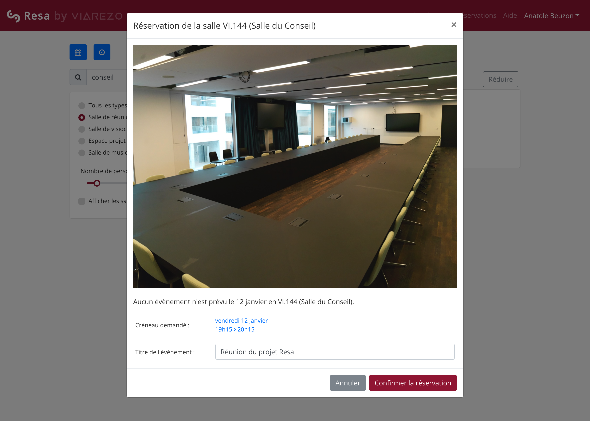

# Resa

[_Resa_](https://resa.centralesupelec.fr/) est conçue pour faciliter l'accès aux espaces de travail et de réunion sur le campus universitaire. Que vous soyez étudiant, enseignant, personnel administratif ou membre de la communauté universitaire, notre service vous permet de réserver facilement des salles adaptées à vos besoins.

## Caractéristiques principales

- **Réservation simplifiée** : Notre interface vous permet de trouver et de réserver une salle en quelques clics. Vous pouvez consulter les disponibilités, les capacités d'accueil et les équipements disponibles associés à chaque salle.

- **Gestion de groupe d'accès** : Le système offre la possibilité de créer des groupes d'accès pour faciliter la gestion des réservations. Les administrateurs peuvent définir des groupes spécifiques avec des privilèges d'accès à certaines salles, en fonction des affiliations ou des besoins particuliers des utilisateurs. Cela permet de garantir une utilisation efficace et équitable des espaces disponibles.

- **Diversité des espaces** : Que vous ayez besoin d'une salle de classe, d'un auditorium, d'une salle de conférence ou d'un espace de réunion, nous avons une large gamme d'options pour répondre à vos besoins. Vous pouvez filtrer les salles en fonction de leur taille, de leur équipement ou de leur emplacement sur le campus.

- **Notifications et rappels** : Vous recevrez des notifications par e-mail pour vous tenir informé de l'état de votre réservation.

- **Authentification CAS** : Notre service permet de s'authentifier via CAS. Cela vous permet de vous connecter avec vos identifiants institutionnels et d'accéder facilement à la plateforme de réservation de salle.

- **Intégration OpenPortal** : Resa utilise le référentiel de salles ainsi que le système de réservation de la solution OpenPortal d'[Alcuin](https://www.alcuin.com/)

- **Création de rendez-vous dans MS365** : Lorsque vous effectuez une réservation, une invitation de rendez-vous MS365 est créée et vous disposez d'un lien Microsoft Teams pour pouvoir y participer à distance. Si la salle est équipée d’un appareil adapté, vous n’aurez qu’à appuyer sur un bouton pour connecter l’équipement sur la réunion en ligne.

## Comment ça marche

1. **Connectez-vous** : Utilisez vos identifiants CAS pour accéder à l'interface

2. **Recherchez une salle** : Utilisez la fonction de recherche avancée pour trouver une salle qui correspond à vos besoins. Vous pouvez filtrer par date, heure, capacité, équipement et emplacement.

3. **Sélectionnez une salle** : Consultez les détails de chaque salle, y compris les photos et les équipements disponibles. Choisissez la salle qui répond le mieux à vos besoins.

4. **Effectuez la réservation** : Sélectionnez la date, l'heure de début et de fin de votre réservation. Ajoutez des détails supplémentaires si nécessaire et confirmez votre réservation.

5. **Recevez la confirmation** : Vous recevrez une confirmation de réservation par e-mail, après validation par un modérateur si la salle est soumise à approbation des réservations.

<figure markdown>
  
</figure>
